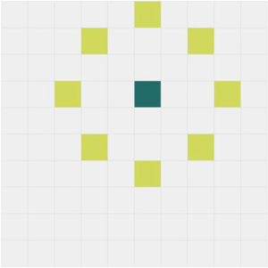

## Description:
Game made in React + Redux.
Levels are getting generated based on modified [Knight's Tour](https://en.wikipedia.org/wiki/Knight%27s_tour) algorithm that uses backtracking.

On first click level with fields is being generated.
Next, player can click only fields that are on the specific distance of previously clicked (marked yellow).
Possible moves will follow this rule:



## Try it out:
https://zarcode.github.io/clickingGame/

## How to run localy:

Download or clone master branch. In the project directory run:

```
npm install
npm start
```

This runs the app in the development mode.<br>
Open [http://localhost:3000](http://localhost:3000) to view it in the browser.
